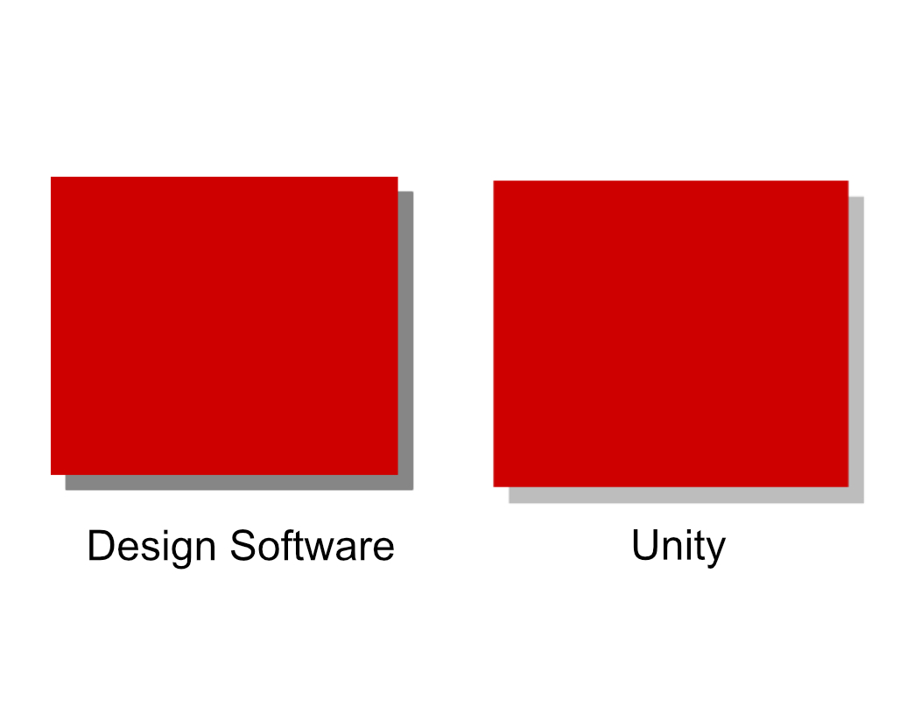
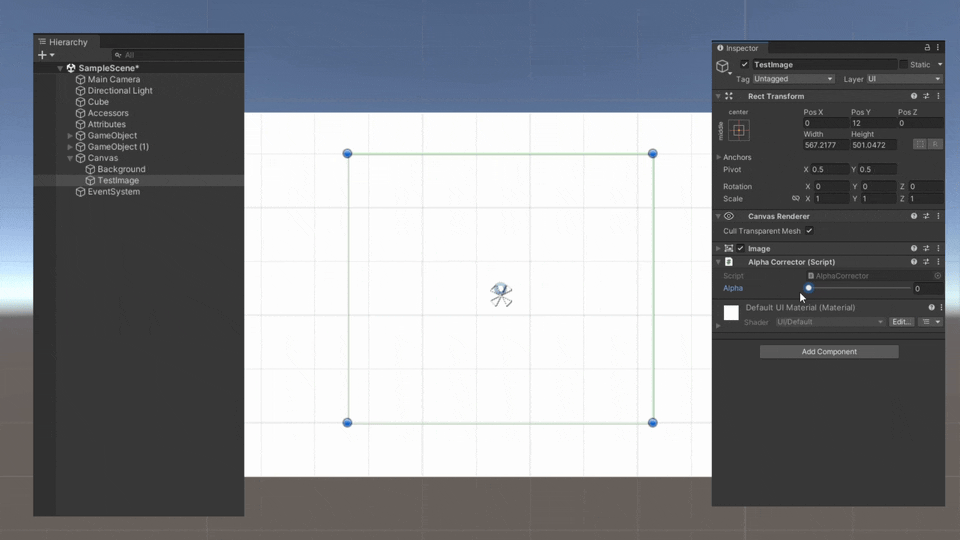

# Unity Alpha Corrector
Script that lets you set Unity images to have alpha values greater than one. This is useful for fixing transparent UI elements that look faded in linear color space.

## How It Works

When your Unity project is set to use linear color space, it handles colors differently from how your graphic design applications might. This can cause transparent images in Unity to appear significantly lighter than they do in your graphic design application. For example, this is the same drop shadow as it appears in Affinity Designer and Unity:

The Alpha Corrector solves this by allowing you to set the "alpha" of your image to a number greater than one by creating duplicates of the image and stacking them on top of each other. This has the effect of darkening the transparent parts of the image.

## Usage

Attach the Alpha Corrector component to the image your wish to darken, and then use the Alpha slider to adjust the darkness of the image. This will create duplicate AlphaObjects as children of your original images. Do not edit these, and do not add any other objects as child objects of the image that you are modifying.

## Installation

[Download](https://github.com/ollyisonit/UnityAlphaCorrector/releases/latest) or clone this repository and place it somewhere in your Unity project's assets folder.